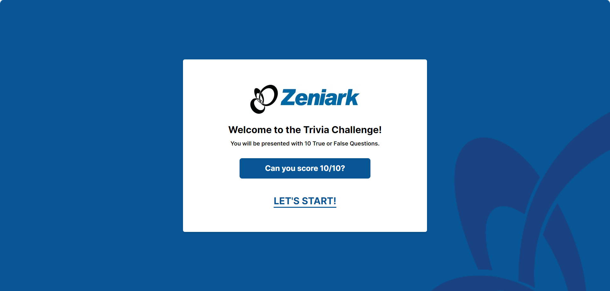
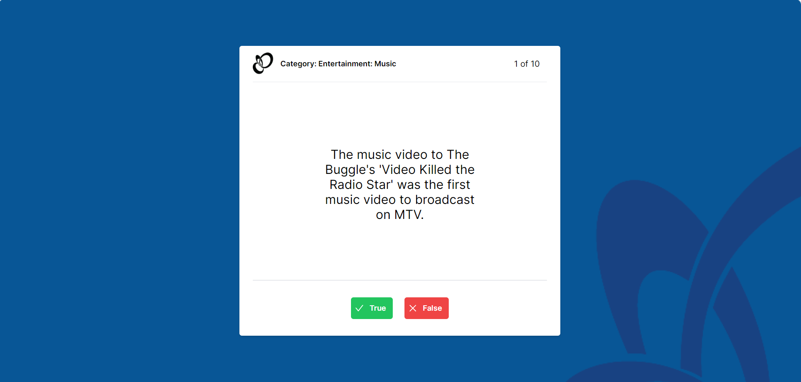
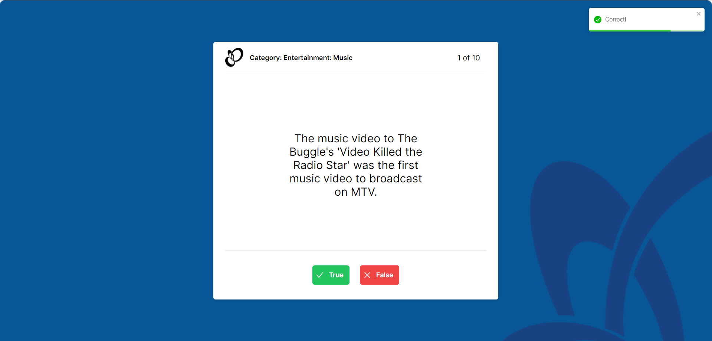
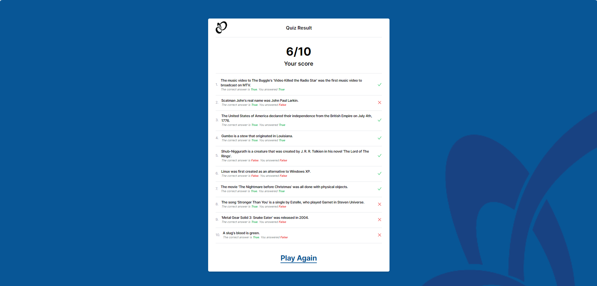

This is a [Next.js](https://nextjs.org/) project bootstrapped with [`create-next-app`](https://github.com/vercel/next.js/tree/canary/packages/create-next-app).

## Getting Started

First, run the development server:

```bash
npm run dev
# or
yarn dev
# or
pnpm dev
# or
bun dev
```

Open [http://localhost:3000](http://localhost:3000) with your browser to see the result.

You can start editing the page by modifying `app/page.tsx`. The page auto-updates as you edit the file.

This project uses [`next/font`](https://nextjs.org/docs/basic-features/font-optimization) to automatically optimize and load Inter, a custom Google Font.

## How To Use?

### Homepage


Step 1: Click "Let's Start!" to start the trivia game.

### Quiz page



Step 2: Answer every question by clicking "True" or "False" buttons. After answering, the game will notify you if you answere is correct or incorrect. The games will generate 10 questions.

### Result page


Step 3: After answering all the 10 question, you will be directed to the Result page. In this page, you will see your score, answered questions, correct answers, your answer, and also icons to see if you are correct or not. You can click "Play Again" button to redirect to the homepage.
